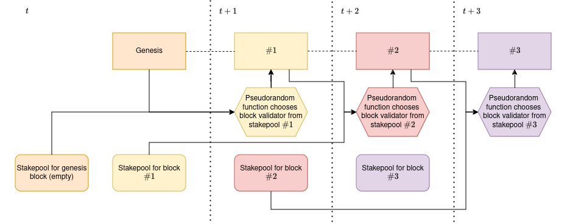

#  vulnCoin

vulnCoin is a very vulnerable blockchain server powered by PoS protocol. Implementation does offer tools to run a Proof of stake consensus protocol, but it does not neccesarily enforce them. We aimed to create the server as simplistic as possible while providing tools for simulation of run of a real PoS network.

## 1. Accounts 

Upon starting the server, randomized address is generated. This address is further reffered to as `vulnCoin address` and is a hexadecimal string of length 64 characters. Servers should be started at with delay of at least one second, to ensure that unique address is generated for each of them. Network does not use any kind of assymetric cryptography purposes, as we tried to make the server as simplistic as possible. In doing so, we of course opened our network to a crucial attack vector - anybody can spend transaction of anybody else. We overcome this issue by stating that in our simulations we expect all network nodes to act honestly, thus simulating as if the network was secure against these issues.

## 2. Transactions

Network works on UTXO model, but newly created outputs do not reference previous output. They are, however, moved between mempool, stakepool and pool of spendable outputs. For a transaction to become spendable, it must be embedded into a block. Transaction hashes use multiple sources of randomness to count txid, namely:

* Address
    * Address of the holder of the output.
* Ammount
    * Ammount of cryptocurrency held in the transaction for simplicity purposes always set to [10].
* Passed
    * Logs how many times the coin was passed in the network, creating a notion of coin chaining.
* Coinbase
    * Bool value defining whether the transaction was made by coinbase transaction or not.
* Timestamp
    * Timestamp of the transaction creation.
* txid
    * Transaction ID defined as $\text{sha256}(\text{address} || \text{ammount} || \text{passed} || \text{coinbase} || \text{timestamp})$, where $||$ is a standard string concatenation operator.

Even though many entropy generators are used, in our PoCs (with only three servers!) we always sleep for one second after creating a transaction, to completely remove the threat of duplicate txids existing in the network.

## 3. Block
Blocks consist of three properties:
* prevBlockHash
  * Hash of the block is defined as $\text{sha256}(\text{prevBlockHash} || \text{transactionsHash})$, where $||$ is a standard string concatenation operator.
* transactionsHash
  * Transaction hash is defined as $\text{sha256}(\text{txid}_0 || \text{txid}_1 ||\dots||\text{txid}_n)$, where $||$ is a standard string concatenation operator and $\text{txid}_0, \text{txid}_1, \dots,\text{txid}_n \in \text{transactions}$.
* Transactions
  *  Vector of txids of transactions embedded into the block.

Legitimacy of the cryptogrphic link upon block creation is ensured and we assume no node has an intent to break it. 
## 4. Consensus

The network does not enforce consensus, it cannot do so without using more robust cryptographicall techniques. It does, however, give us tools for employing consensus. These tools are used to enforce consensus in our PoC scripts. The consensus above the network is defined as following:

 </img>

`t`
 * A `genesis` block is created automatically by the network.
 * Network users can stake for creation of block `#1` and, but the stakePool has to be finalised before the time `t+1`.

 `t+1`
 * Stakepool for `genesis` block and `genesis` block are used as inputs for the pseudorandom function that selects the block creator from stakepool `#1`.
 * Stakepool for block `#2` is opened.

 `t+2`
 * Stakepool for block `#1` and block `#1` are used as inputs for the pseudorandom function that selects the block creator from stakepool `#2`.
 * Stakepool for block `#3` is opened.

 The whole process continues in the same fashion until the network is stopped.
 
 Let $H$ represent `SHA256` hash of the last block in the blockchain, $\{a_1, a_2, \dots,a_n\} \in S$ stakepool where each vulnCoin address $a$ of the coin holder is represented as hexadecimal string and $N$ number of addresses in the current stakepool. Consider the function $\text{first32bits}()$ that returns the first 32 bits of a string. The pseudorandom selection function is implemented as:

 $$ \text{IndexOfValidator} \equiv (\text{first32bits}(H) + \text{first32bits}(a_1) + \dots + \text{first32bits}(a_n))\mod{N} $$

## 5. Coin age
Due to the fact that we wanted to create a PoC of coin age accumulation attack, we needed to implement option for coin age being a factor in the consensus process. The whole concept is implemented via a flag passed during a start. Implementation is very simplistic and ineffective, but is enough for the purposes of PoCs.

## 6. Commands
To communicate with the server, following set of commands is used:
*   `stop` 
    * Command used to stop the running server.
    * `return`: **null**
*   `getBlockCount`
    * Command used to get number of blocks in the blockchain on the server.
    * `return`: **Number of blocks in the blockchain**
*   `printBlockchain`
    * Print all blocks in the blockchain in order they were appended.
    * `return`: **String representing the blockchain information**
*   `createNewTransaction <txid> <addressSender> <addressReceiver>`
    * Create a new transaction specified by txid and vulncoin address of existing UTXO and address of the receiver.
    * `return`: **Txid of the newly created transaction. If the transaction couldn't have been created, error message.**
*   `loadTransaction <txid> <addressSender> <addressReceiver> <timestamp>`
    * Load an already created transaction. Timestamp needs to be defined to correctly count the new txid.
    * `return`: **null or error message**
*   `loadCoinbaseTransaction <addressReceiver> <timestamp>`
    * Load an already created coinbase transaction. Timestamp needs to be defined to correctly count the new txid.
    * `return`: **Txid of the newly loaded transaction**
*   `proposeBlock {<txid1> <txid2> ... <txidn>}` 
    * Propose a new block with specified txids to be created.
    * `return`: **null or error message in case of failure**
*   `stake <txid> <addressSender>` 
    * Stake transaction specified by txid and address of the holder.
    * `return`: **null or error message in case of failure**
*   `countNextValidator` 
    * Count the creator of the next block based on the stakepool with respect to coinAge flag.
    * `return`: **vulnCoin address of the selected staker**
*   `listMempool`
    * Print current mempool state.
    * `return`: **Transactions in the mempool**
*   `listMempoolLinkedToMe` 
    * Print transactions from the mempool linked to the server address.
    * `return`: **Transactions in the mempool linked to vulnCoin address of the server**
*   `listUnspent` 
    * Print currently unspent transactions.
    * `return`: **Spendable UTXOs**
*   `listUnspentLinkedToMe` 
    * Print currently unspent transactions linked to server vulnCoin address.
    * `return`: **Spendable UTXOs linked to the server vulnCoin address** 
*   `listStakepool` 
    * Print the stakepool with respect to coinAge flag.
    * `return`: **Transactions in the stakepool**
*   `listOldStakepool`
    * Print the stakepool of previous consensus round with respect to coinAge flag.
    * `return`: **Transactions in the stakepool of previous consensus round**
*   `generate` 
    * Generate single block containing only a coinbase transaction to the vulnCoin address of the server.
    * `return`: **null**
*   `printAddress`
    * Print vulnCoin address of the server.
    * `return`: **vulnCoin address of the server**
*   `printTransaction <txid>`
    * Print transaction defined by txid.
    * `return`: **Contents of the searched transaction**

## 7. Installation and Start
To install the server, clone the repository and build a binary by initiating `make` command. Then issue:

`sudo mv bin/vulnCoin-server /bin/vulnCoin-server`

To start the server, simply issue:

`vulnCoin-server <portNumber> <coinAge>`
